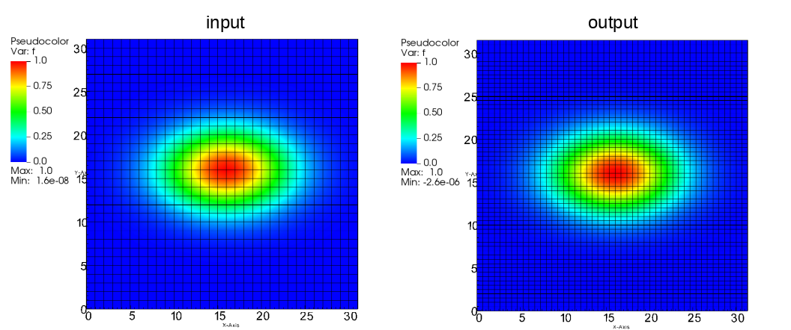
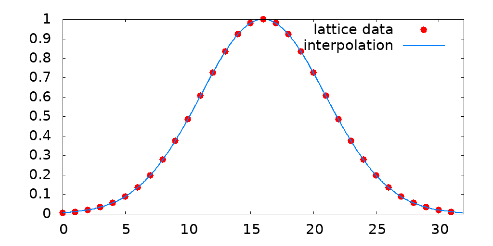

# Info - winterp

C99 library for interpolating data defined on a spatial lattice. The library uses spectral methods for high-quality results.  
The supports:
* 1D data,
* 2D data, 
* 3D data.
It can iterpolate:
* real functions,
* complex function,
* vector function (assuming data aligment consistent with [WDATA](https://gitlab.fizyka.pw.edu.pl/wtools/wdata) format).

# Compiling lib
Edit header of `Makefile` and:
```bash
make
```
*Note*: you need to have installed [FFTW](http://www.fftw.org/).  

The compilation process will produce:
* `libwinterp.a` - static library
* `libwinterp.so` - dynamic library

Header file is located in `./c/` folder.

In addition, testcases and example codes will be compiled. In order to compile only the lib:
```bash
make lib
```

# API
List of functions is provided in header file .

# Lattice interpolation to a new resolution  

Example usage of the whole lattice interpolation to the new resolution is shown below
```c
/**
 * W-interp Library 
 * @see https://gitlab.fizyka.pw.edu.pl/wtools/winterp
 * 
 * This example shows how to interpolate data defined in the 2D lattice to a new resolution. . 
 * 
 * */ 

// winterp lib
#include "winterp.h"

// other libs
#include <stdlib.h>
#include <stdio.h>
#include <string.h>
#include <math.h> 

// test function
double tfx(double x, double a, double x0)
{
    return exp(a*pow(x-x0,2));
}


int main()
{
    // initial lattice
    int inNX=32, inNY=32; 
    double inDX=1.0, inDY=1.0;
    
    // fill input array with some function
    double *input = (double *)malloc(inNX*inNY * sizeof(double));
    
    int ix, iy, ixy=0;
    double ax=-0.02, ay=-0.05;
    for(ix=0; ix<inNX; ix++) for(iy=0; iy<inNY; iy++) 
    {
        input[ixy] = tfx(inDX*ix, ax, inDX*inNX/2)*tfx(inDY*iy, ay, inDY*inNY/2); // 2D gaussian
        ixy++;
    }
    
    // parameters of new lattice
    int outNX=48, outNY=64; 
    
    double *output = (double *)malloc(outNX*outNY * sizeof(double));
    
    // interpolate to new lattice with new resolution, while keeping fixed volume
    winterp_interpolation_2dr(inNX, inNY, input, outNX, outNY, output);
    
    
    // save arrays
    FILE *f;
    // save input
    f=fopen("input_f.wdat", "wb");
    fwrite (input , sizeof(double)*inNX*inNY, 1, f);
    fclose(f);
    // save output
    f=fopen("output_f.wdat", "wb");
    fwrite (output , sizeof(double)*outNX*outNY, 1, f);
    fclose(f);    
    
    return 0; 
}
``` 
Result of the interpolation is shown on fig below:


# Interpolation for arbitrary point in space
The example below demonstrates how to extract function values for arbitrary points in space. 
```c
/**
 * W-interp Library 
 * @see https://gitlab.fizyka.pw.edu.pl/wtools/winterp
 * 
 * This example shows how to interpolate 2D data
 * 
 * */ 

// winterp lib
#include "winterp.h"

// other libs
#include <stdlib.h>
#include <stdio.h>
#include <string.h>
#include <math.h> 

// test function
double tfx(double x, double a, double x0)
{
    return exp(a*pow(x-x0,2));
} 


int main()
{
    // initial lattice
    int inNX=32, inNY=32; 
    double inDX=1.0, inDY=1.0;
    
    // fill input array with some function
    double *input = (double *)malloc(inNX*inNY * sizeof(double));
    
    int ix, iy, ixy=0;
    double ax=-0.02, ay=-0.05;
    for(ix=0; ix<inNX; ix++) for(iy=0; iy<inNY; iy++) 
    {
        input[ixy] = tfx(inDX*ix, ax, inDX*inNX/2)*tfx(inDY*iy, ay, inDY*inNY/2); // 2D gaussian
        ixy++;
    }
    
    // print function along x, for fixed y=inDY*inNY/2
    for(ix=0; ix<inNX; ix++) printf("%12.8f %16.12g\n", inDX*ix, input[inNY/2 + ix*inNY]);
    printf("\n\n");
    
    // create interpolator
    winterp_interpolator iinput;
    winterp_create_interpolator_2d_r(inNX, inNY, inDX, inDY, input, &iinput);

    // print interpolated function along x, for fixed y=inDY*inNY/2
    double x=0.0, vr; 
    while(x<inDX*inNX)
    {
        winterp_getvalue_2d_r(&iinput, x, inDY*inNY/2, &vr);
        printf("%12.8f %16.12g\n", x, vr);
        x+=0.1; // increment
    }
    
    winterp_destroy_interpolator(&iinput);

    return 0; 
}
```
Result of the interpolation is shown on fig below:


