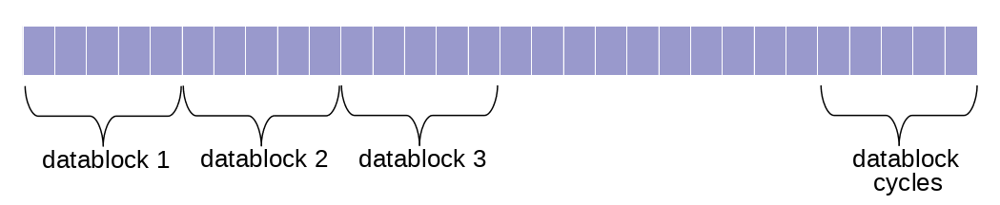
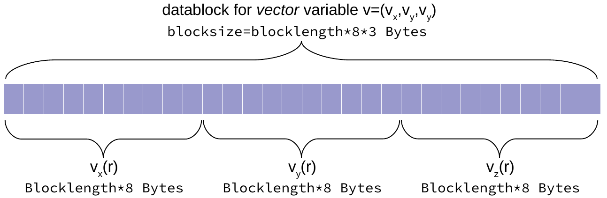

[[_TOC_]]
# Introduction
**W-data** was designed to satisfy the following requirements:
* Binary data is stored in a **conceptually easy format** that allows a variety of tools/languages to be used.
* Format provides storage for data with time stepping (frames/measurements/cycles).
* Data format is suitable for parallel processing (preferably with MPI I/O).
* Data is easy to process via [VisIt](https://visit-dav.github.io/visit-website/index.html).
* It provides an extensible framework - new variables can be created and easily added to the existing dataset.  
* Data is convenient for copying between computing systems.  
* It allows for easy extraction/copying of selected variables.

**W-data** format **is not a library**. It is only a **concept**. It specifies how the data should be saved or read. It means that you do not need to use any external libraries to be able to read or write. It is sufficient to use standard I/O functions to work with this format. We provide within this repository libraries written in C or in Python just for convenience. The example code demonstrating this concept can be found here [
c-examples
/example-write-low-level.c](https://gitlab.fizyka.pw.edu.pl/wtools/wdata/-/blob/master/c-examples/example-write-low-level.c). The concept is described below. 

# W-data format concept  
The data set will consist of a set of files, for example:
```bash
test.wtxt           # metadata file, this one should be indicated when opening in VisIt
test_density_a.wdat # binary file with data
test_delta.wdat     # binary file with data
test_current_a.wdat # binary file with data
```  
The content of test.wtxt may look like this:
```bash
# Comments with additional  info about the data set
# Comments are ignored when reading by the parser  

nx                       24   # lattice
ny                       28   # lattice
nz                       32   # lattice
dx                        1   # spacing
dy                        1   # spacing
dz                        1   # spacing
x0                      -12   # origin of x-axis
y0                      -14   # origin of y-axis
z0                      -16   # origin of z-axis
datadim                   3   # dimension of block size: 1=nx, 2=nx*ny, 3=nx*ny*nz
prefix                 test   # prefix for files belonging to this data set`
cycles                   10   # number of cycles (measurements)
t0                        0   # time value for the first cycle
dt                        1   # time interval between cycles

# variables
# tag                  name                    type                    unit                  format
var               density_a                    real                    none                    wdat
var                   delta                 complex                    none                    wdat
var               current_a                  vector                    none                    wdat

# links
# tag                  name                 link-to
link              density_b               density_a
link              current_b               current_a

# consts
# tag                  name                   value                    unit
const                    eF                     0.5                     MeV
const                    kF                       1                    1/fm
```  
According to our experience, three types of variables (`real`, `complex`, `vector`) are sufficient and cover more than 90% of applications. 

Binary files store data as row arrays called `datablocks`:  


The variables can be stored either in double or float precision.

| type      | float    | double      |
|-----------|----------|-----------|
| real      | `real4`    | `real`, `real8`  |
| complex   | `complex8` | `complex`, `complex16` |
| vector    | `vector4`  | `vector`, `vector8`  |

The size of the `datablock` depends on the variable type and the data dimensionality, and is computed according formula (result in bytes B):  
`blocksize=blocklength*sizeB`  

The `blocklength` depends on the data dimensionality (`datadim`)
|datadim | blocklength|
| -------| -----------|
|1 | `nx`|
|2 | `nx*ny`|
|3 | `nx*ny*nz`|

The `sizeB` depends on the data type
| type | sizeB | comment | 
| -----| ------| -------|
|`real`, `real8`  | 8 | `sizeof(double)` |
| `real4`  | 4 | `sizeof(float)`    
| `complex`, `complex16` | 16 | =8\*2 double\*(re,im) | 
| `complex8` | 8 | =4\*2 float\*(re,im) |
| `vector(d)`, `vector8(d)`  |8\*d| d-vector dimensionality, d=1,2,3(default) |
| `vector4(d)`  |4\*d| d-vector dimensionality, d=1,2,3(default) |

## Scalars: real 
Real variables are stored as single-dimensional arrays, where we use the following prescription of the coordinate decoding
```c
// lattice indicase
int ix=...; // ix in [0,nx)
int iy=...; // iy in [0,ny)
int iz=...; // iz in [0,nz)

// coordinate decoding
double x = x0 + dx*ix;
double y = y0 + dy*iy;
double z = z0 + dz*iz;

// array index
int ixyz = iz + nz*iy + nz*ny*ix; 
double *var; // pointer to real array
var[ixyz]=...; // value for the given coordinate
```

## Scalars: complex
The complex variables are stored as pairs of two real numbers: real and imaginary parts. To store the complex variables, we use native C types `double complex` or `float complex`. These are structures with two double/float fields. 
```c
// array index
int ixyz = iz + nz*iy + nz*ny*ix; 
double complex *varC; // pointer to real array
varC[ixyz]=1.0 + 2.0*I; // complex value for the given coordinate

// or you can cast it to a real array of size 2*nx*ny*nz
double *var = (double*)varC;
var[2*ixyz+0]=1.0; // real part
var[2*ixyz+1]=2.0; // imaginary part
```

## Vectors
For vector variables, we do not introduce a new structure. Instead, we store components of vector variables in separate arrays, placed one by one. The number of components is given in the parentheses at the end of the type name `vector(d)`. If the number of components is not given, the default value `d=3` is assumed. Thus, `vector` is equivalent to `vector(3)`. The vector variable of type `vector(1)` becomes equivalent to `real`.  

The storage pattern for a `vector(3)` variable is shown below:   


Below example of an element decoding
```c
// For 3d vector v = [v_x(x,y,z), v_y(x,y,z), v_z(x,y,z)]
double *var; // pointer to real array
dataV[ixyz + 0 * blocklength] = v_x; // 
dataV[ixyz + 1 * blocklength] = v_y;
dataV[ixyz + 2 * blocklength] = v_z;
```

Let's get back to the `*wtxt` file.

# Tags

W-data format allows for the representation of the following elements:

## Variables
Each variable is represented by the binary file of name `prefix_varname.format`. The variable description has the following format:  
```
var         name          type          unit         format
```
The following formats are allowed:  
  * `wdat`: default format for WSLDA codes. Binary files contain row data (no header).
  * `npy`: binary files are *numpy* arrays. (_C library supports only read mode._)
  * `dpca`: (*deprecated*) previous format of cold atomic codes. The binary file contains a header of size 68B, where additional info about the file content is stored. For this format, *wdata* lib provides only reading functionality.  

Examples
```bash
# Each variable is represented as separate file of name <prefix>_<name>.<format>
# tag       name        type        unit        format 
var           v1      vector          vF          wdat    # all fields are specified
var           v2     complex          eF                  # variable with specified unit (eF) and default format (wdat)
var           v3        real                              # this variable has no unit (none) and default format (wdat)
var           v4      vector        none                  # this variable has no unit (none) and default format (wdat)
var           v5      vector                     wdat     # this variable has no unit (none) and spefified format (wdat)
```

## Links
It is an alternative name for a given variable. The entry has a form
```
link        alternative-name  var-name
```
Frequently, users call the same variable differently. For example, the user creates a variable
```
var         density             real              none           wdat
```
while another user, in his/her code, uses the name `rho` for the same variable. To maintain the operability of the code that uses the variable `rho`, the second user can add an entry to `*wtxt` file in the form
```
link        rho        density    # rho is the same as variable density
```

## Constants  
Typically, besides variables, we have some useful constants during the data analysis process. To provide values of selected constants, we use `const` field. The syntax is
```
const            name            value             unit
```
Examples:
```bash
# Constants 
# tag       name        value       unit
const      alpha     0.007297                   # constant with no unit (none)
const         pi       3.1415       none        # constant with no unit (none)
const         m           0.1         kg        # constant with unit (kg)
```

## Txt files
The wtxt file can also contain info about additional text files associated with the dataset. 
Note, beside this info in the wtxt file, C library do not provide any extra functionality for text files.  
```bash
# This tag indicates that the file prefix_myfile.txt also belongs to the dataset
# The tag is used only by VisIt plugin
txt         myfile.txt
```
# Domain
## Coordinates
```
datadim                  3    # for 2d case, you can skip tags nz, dz, z0
                              # for 1d case, you can skip tags ny,nz, dy,dz, y0,z0

nx                       24   # number of points along the x-direction
ny                       28   # number of points along the y-direction
nz                       32   # number of points along the z-direction
dx                        1   # spacing along the x-direction
                              # if dx` is negative, then the x-coordinate should be extracted from the extra file `prefix__x.wdat`.
dy                        1   # spacing along the y-direction
                              # if dy` is negative, then the y-coordinate should be extracted from the extra file `prefix__y.wdat`.
dz                        1   # spacing along the z-direction
                              # if dz` is negative, then the z-coordinate should be extracted from the extra file `prefix__z.wdat`.
x0                      -12   # origin of x-axis, if not specified, then default x0=0
y0                      -14   # origin of y-axis, if not specified, then default y0=0
z0                      -16   # origin of z-axis, if not specified, then default z0=0
```

The coordinates are converted into an array index using row-major prescription
```c
// lattice indicase
int ix=...; // ix in [0,nx)
int iy=...; // iy in [0,ny)
int iz=...; // iz in [0,nz)

// coordinate decoding
double x = x0 + dx*ix;
double y = y0 + dy*iy;
double z = z0 + dz*iz;

// array index: 3d case
int ixyz = iz + nz*iy + nz*ny*ix; 
```
If `dx` is negative, then the x-coordinate has to be extracted from the additional binary file of the name `prefix__x.wdat`. For more information, see the implementation of function `wdata_get_x`(...) from our C library. The same applies to coordinates y and z. 

## Time
```
cycles                   10   # number of cycles (measurements)
t0                        0   # time value for the first cycle
dt                        1   # time interval between cycles
                              # if dt` is negative, then the time should be extracted from the extra file `prefix__t.wdat`.
```
To compute the time associated with a given `icycle`, we use the formula
```
time = t0 + dt * icycle;
``` 
If `dt` is negative, then the `time` parameter has to be extracted from the additional binary file of the name `prefix__t.wdat`. For more information, see the implementation of function `wdata_get_time`(...) from our C library.
